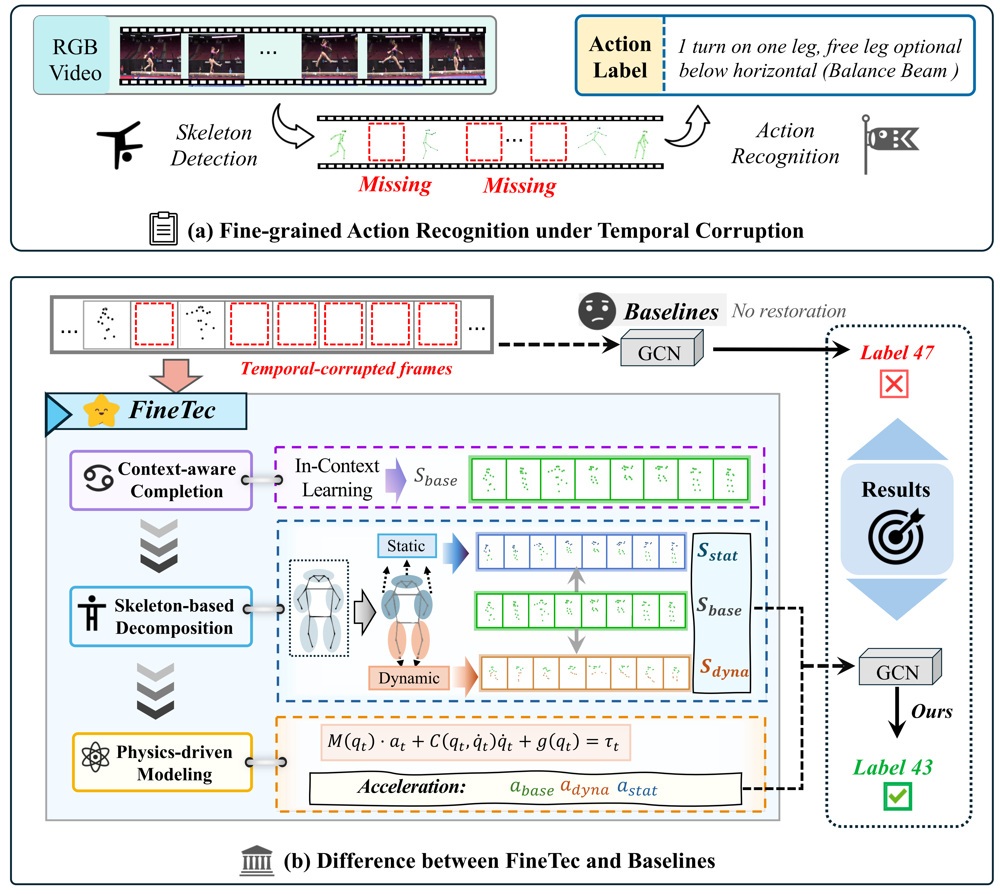

<!-- <p align="center">
    
<p> -->
<h2 align="center"> FineTec: Fine-Grained Action Recognition Under Temporal Corruption via Skeleton Decomposition and Sequence Completion</h2>
<!-- {: width="50%"} -->
<!--  -->
<div align="center">
<!-- </img> -->


_**[Dian Shao](https://scholar.google.com/citations?user=amxDSLoAAAAJ&hl=en)<sup>†</sup>, [Mingfei Shi](https://github.com/SmartDianLab/FinePhys), [Like Liu](https://likeliu.com)**_
<br><br>
<sup>†</sup>Corresponding Author
<br>
Northwestern Polytechnical University

<h5 align="center"> If you like our project, please give us a star ⭐ on GitHub for latest update.  </h2>
 <a href='https://arxiv.org/abs/2512.25067'></a> &nbsp;
 <a href='https://smartdianlab.github.io/projects-FineTec/'></a> &nbsp; 
<br>
<strong>The 40th Annual AAAI Conference on Artificial Intelligence (AAAI-26)</strong>
</div>

## Abstract
Recognizing fine-grained actions from temporally corrupted skeleton sequences remains a significant challenge, particularly in real-world scenarios where online pose estimation often yields substantial missing data. Existing methods often struggle to accurately recover temporal dynamics and fine-grained spatial structures, resulting in the loss of subtle motion cues crucial for distinguishing similar actions. To address this, we propose FineTec, a unified framework for Fine-grained action recognition under Temporal Corruption. FineTec first restores a base skeleton sequence from corrupted input using context-aware completion with diverse temporal masking. Next, a skeleton-based spatial decomposition module partitions the skeleton into five semantic regions, further divides them into dynamic and static subgroups based on motion variance, and generates two augmented skeleton sequences via targeted perturbation. These, along with the base sequence, are then processed by a physics-driven estimation module, which utilizes Lagrangian dynamics to estimate joint accelerations. Finally, both the fused skeleton position sequence and the fused acceleration sequence are jointly fed into a GCN-based action recognition head. Extensive experiments on both coarse-grained (NTU-60, NTU-120) and fine-grained (Gym99, Gym288) benchmarks show that FineTec significantly outperforms previous methods under various levels of temporal corruption. Specifically, FineTec achieves top-1 accuracies of 89.1% and 78.1% on the challenging Gym99-severe and Gym288-severe settings, respectively, demonstrating its robustness and generalizability.

<!-- <table class="center">
    <tr>
    <td></td>
    </tr>
</table> -->
 
## 🔥 Update
- __[2026.05.21]__: Dataset FineGym-skeketon V2 released, including Gym99-skeleton and Gym288-skeleton. In this version, we have re-labeled the first frame of all samples from the two subsets to improve the accuracy of skeleton extraction.
- __[2026.03.14]__: Paper released on AAAI.
- __[2025.12.31]__: Paper released on arXiv.
- __[2025.12.30]__: Dataset FineGym-skeleton V1 released, including Gym288-skeleton.
- __[2025.11.08]__: Github repository initialized.


## 🧰 TODO

- [x] Release paper.
- [x] Release dataset.
- [ ] Release training code
- [ ] Release inference code.
- [ ] Release model weights.

## 📊 Dataset

The **FineGym-skeleton** dataset is a human skeleton-based action recognition benchmark derived from [FineGym](https://sdolivia.github.io/FineGym/). It provides temporally precise, fine-grained gymnastics annotations together with 2D human pose sequences extracted from RGB subaction clips. The dataset contains two subsets: **Gym99-skeleton** and **Gym288-skeleton**.

This dataset supports research on:

- Fine-grained action recognition
- Temporally corrupted or incomplete action modeling
- Skeleton-based representation learning
- Physics-aware motion understanding

### Key Statistics

| Item | Gym99-skeleton | Gym288-skeleton |
|---|---:|---:|
| Action classes | 99 | 288 |
| Total instances | 34,803 | 38,935 |
| Training samples | 26,282 | 29,290 |
| Validation samples | 8,521 | 9,645 |
| Total annotated frames | 1,617,291 | 1,882,226 |
| Frames per sample (min / mean / max) | 2 / 46.47 / 725 | 2 / 48.34 / 725 |

Each sample contains one tracked gymnast represented by **17 COCO-style 2D keypoints per frame**. The action classes cover four apparatuses: Floor Exercise (FX), Balance Beam (BB), Uneven Bars (UB), and Vault — Women (VT).

### Annotation Pipeline

For each RGB subaction clip, a bounding box was manually annotated on the first frame to identify the target gymnast. [OSTrack](https://github.com/botaoye/OSTrack) was then used to track the target throughout the clip, followed by [HRNet](https://github.com/leoxiaobin/deep-high-resolution-net.pytorch) for frame-by-frame skeleton keypoint extraction.

The release also includes **39,092 FineGym RGB subaction clips**, organized into four parts with a total size of approximately **8.39 GB**.

The skeleton annotations, RGB subaction clips, detailed statistics, and data format documentation are available on [Hugging Face](https://huggingface.co/datasets/Lozumi/FineGym-skeleton).

## 🧰 Models

Coming Soon~


## 📝 Citation
Please consider citing our paper if our work is useful. Also cite [FineGym](https://sdolivia.github.io/FineGym/) if you use dataset FineGym-skeleton.
```bib
@article{shao2026finetec,
  title={FineTec: Fine-Grained Action Recognition Under Temporal Corruption via Skeleton Decomposition and Sequence Completion},
  volume={40},
  url={https://ojs.aaai.org/index.php/AAAI/article/view/37838},
  doi={10.1609/aaai.v40i11.37838},
  number={11},
  journal={Proceedings of the AAAI Conference on Artificial Intelligence},
  author={Shao, Dian and Shi, Mingfei and Liu, Like},
  year={2026},
  month={Mar.},
  pages={8842--8850}
}
```


## 📪 Contact

For any question, feel free to email ```mingfeishi5@mail.nwpu.edu.cn```.
